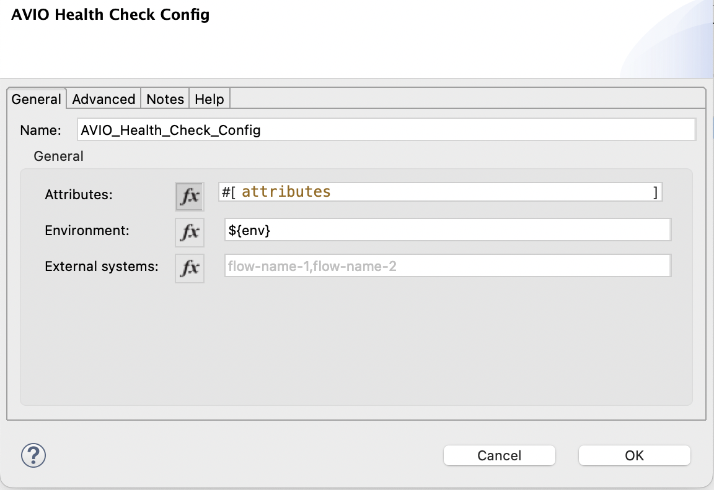
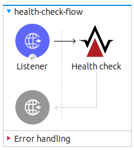

# Health Check API
The  **health check api** is a XML connector implemented with the XML SDK. When added as a maven dependency into your Mule project gives your application additional resources and capabilities to **GET** general statistical information of the Operating System Server, Mule Runtime, and the Java Virtual Machine your application is deployed into. In addition to this it can also be configured to get the connectivity status of application/services/systems being used by your application.


## Setup
### Project Changes

1. Add the maven dependency to the applications **pom.xml** file.  Make sure to use the latest version. 
```
<dependency>
    <groupId>com.avioconsulting.mule</groupId>
    <artifactId>mule-health-check-api</artifactId>
    <version>3.0.0</version>
    <classifier>mule-plugin</classifier>
</dependency>
```
2. Create a Global Configuration for the **AVIO Health Check Config**.


- **attributes**: Use default value. Should always be the attributes predefined variable.
- **environment**: Environment Name. It defaults to ‘env’ property.
- **log category**: Required value without default to force user to enter value. This gets added any health-check logs.
- **external systems**: comma separated list of flow names to handle external systems. See [External System Montoring](##External System Monitoring) for more information.
3. Add a new flow to your project, with its own http listener. Make sure to set the listener Path to `/monitor/*`
4. Drop in the **Health Check** operation.



### Securing the health-check separately

To secure the health-check-api with its own client application credentials, the RAML must be added to the organizations Design Center and an API Instance must be created.
1. Design Center:
   1. Zip `src/main/resources/api` directory in the source code
   2. “Create New → Import from File” Design Center project “Health Check API” with the Zipped specification
   3. Publish specification to **Exchange** (Asset Version 1.0.0 or as applicable)
2. API Manager:
   1. Begin with lower environments first
   2. Create a new API from the exchange published API - “Manage API → Manage API From Exchange”
   3. Lookup the newly published “Health Check API for Mule 4” and Save.
   4. Apply *Client ID Enforcement* Policy to this API.
3. Exchange:
   1. Search for the *Health Check API* in **Exchange** and request access to the applicable application.
4. Project
   1. Create an **API Autodiscovery** configuration in your project, with the *API Id* from API Manager (use best practices and store this value in an environment property file) and the name of the http listener flow that was created.

## Usage

The following resources will be added to the base URI of your application :

- <base_uri>**/monitor/health** - Most commonly used endpoint that aggregates the runtime and app endpoints
- <base_uri>**/monitor/health/runtime** - retrieves just the JVM runtime information
- <base_uri>**/monitor/health/app** - retrieves information about the application

Sample response from `/monitor/health`:
```
{
    "muleProperties": {
        "muleRuntime": "4.2.2",
        "apiName": "health-check-api",
        "server": "AC0084",
        "url": "http://localhost:8081/lib/health/check",
        "ip": "0.0.0.0",
        "timeZone": "America/Chicago",
        "environment": "DEV"
    },
    "jvmProperties": {
        "pid": "29488@AC0084",
        "vmName": "Java HotSpot(TM) 64-Bit Server VM",
        "vmVendor": "Oracle Corporation",
        "vmVersion": "1.8.0_231",
        "locale": "English (United States)",
        "memory": {
            "heapMemoryUsage": {
                "init": 264241152,
                "used": 212208352,
                "committed": 513802240,
                "max": 3756523520
            },
            "nonHeapMemoryUsage": {
                "init": 2555904,
                "used": 61171016,
                "committed": 62193664,
                "max": -1
            }
        },
        "threadCount": {
            "activeThreadCount": 54,
            "daemonThreadCount": 48
        },
        "garbageCollection": [{
                "gcName": "PS Scavenge",
                "collectionCount": 8,
                "collectionTime": 67
            }, {
                "gcName": "PS MarkSweep",
                "collectionCount": 2,
                "collectionTime": 221
            }
        ]
    },
    "osProperties": {
        "osName": "Windows 10",
        "osVersion": "10.0",
        "osArchitechture": "amd64",
        "systemLoadAverage": -1.0,
        "availableProcessors": 12,
        "freePhysicalMemorySize": 3750350848,
        "processCpuTime": 14437500000,
        "systemCpuLoad": 0.0,
        "processCpuLoad": 0.05657935521623634
    },
    "timestamp": "2019-12-27T11:23:18.168-06:00",
    "correlationId": "925bfc10-28cd-11ea-b774-105bad3268d7",
    "systems": [{
            "systemName": "HTTPS",
            "connectionConfig": "api-dev.srs.aws.avioconsulting.com:443/orders-system-api",
            "user": "N/A",
            "status": "OK",
            "exception": "N/A",
            "timestamp": "2020-01-07 10:43:11"
        }, {
            "systemName": "Amazon S3",
            "connectionConfig": "N/A",
            "user": "N/A",
            "status": "ERROR",
            "exception": "N/A",
            "timestamp": "2020-01-07 10:43:21"
        }, {
            "systemName": "SQLServer",
            "connectionConfig": "jdbc:sqlserver://localhost;ODSAPI;ODSApiApp",
            "user": "N/A",
            "status": "UNKNOWN",
            "exception": "N/A",
            "timestamp": "2020-01-07 10:43:34"
        }
    ]
}
```


## External System Monitoring

The health check can be used to monitor external systems. This is done through custom health flows that are added to an application. The flow should contain a simple operation or query that validates the health of the system. This typically would be a simple `GET` http request to a target system, or simple `SELECT` SQL query on a database. The implementation is left up to the developer. Any information can be returned, but must include a `status` with values of **OK**, **ERROR**, or **UNKNOWN**. Below are some sample responses from external health check flows.
 ```
  { 
    "systemName": "DB", 
    "connectionConfig": "jdbc:sqlserver://<server-url>;<db>;<user>", 
    "user" : "DB_USER", 
    "status": "OK", 
    "timeStamp" : "2020-02-02 11:12:13" 
  }
  ```
  ```
  { 
    "systemName": "Amazon S3", 
    "status": "ERROR", 
    "exception": "This machine does not have access to the S3 bucket", 
    "timestamp": "2020-01-07 10:43:21" 
  }
  ```
  ```
  { 
    "systemName": "<Incorrect flow Name Value>",
    "status": "UNKNOWN", 
    "exception": "Could Not Find the Flow", 
    "timestamp": "2020-01-07 10:43:21" 
  }
  ```

## SNAPSHOT or Local Testing

If a `SNAPSHOT` version is desired, either a local install (`mvn install`) can be done, or add the Sonatype repository to the project **pom.xml** file under `pluginRepositories`.
```
<pluginRepository>
    <id>sonatype</id>
    <name>Nexus Repository</name>
    <layout>default</layout>
    <url>https://oss.sonatype.org/content/repositories/snapshots/</url>
</pluginRepository>
```


